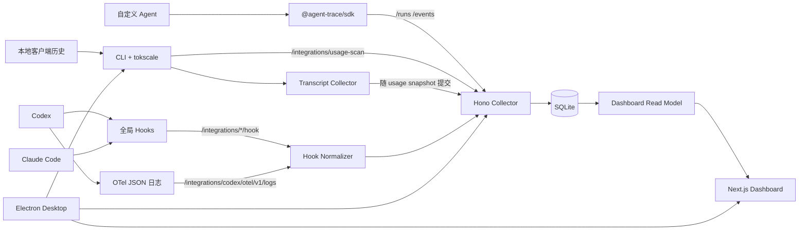

# Agent-Trace 系统架构

领域术语以[领域词汇表](../CONTEXT.md)为准，长期设计理由见[架构决策记录](adr/README.md)。

## 总体结构

Agent-Trace 使用本地单机架构。多个采集入口写入同一个 Collector，Collector 规范化并持久化数据，Dashboard 通过只读查询接口展示结果，Desktop 负责把这些进程组织为一个 Windows 应用。

## 模块职责

| 模块 | 职责 | 主要依赖 |
| --- | --- | --- |
| `packages/schema` | 定义 Run、Event、Token、Dashboard 和 transcript 类型及 Zod 校验。 | Zod |
| `packages/sdk-js` | 创建 Run，包装 LLM/工具异步调用，有界投递数据。 | Schema、Fetch API |
| `packages/cli` | 编排开发服务，安装 Hooks，运行 `tokscale`，协调历史和 transcript。 | tokscale、Node.js |
| `apps/server` | HTTP 接入、规范化、SQLite 迁移/存储、分页读模型和诊断。 | Hono、Drizzle、better-sqlite3 |
| `apps/web` | 运行列表、详情、筛选、树形追踪、成本和 Scanner 状态界面。 | Next.js、React、共享 Schema |
| `apps/desktop` | 启动/停止本地服务、托盘与关闭偏好、资源解包和 Windows 打包。 | Electron、electron-builder |

## 核心数据模型

### runs

一条 Run 表示一次 Agent 或本地会话执行：

- 主键：`id`。
- 身份与状态：`name`、`status`、`started_at`、`ended_at`。
- 内容：`input_json`、`output_json`、`error`。
- 扩展：`metadata_json`。

### events

Event 表示 Run 内的步骤：

- 主键：`id`，外键 `run_id` 级联关联 runs。
- `parent_id` 表达父子关系，但不强制外键约束。
- `type`、`name`、`status`、`timestamp`、`duration_ms` 描述步骤。
- input、output、error、metadata 分别以 JSON 文本保存。
- 索引覆盖 `run_id`、`run_id + timestamp`。

### usage_sessions

保存本地扫描得到的会话级用量，以 `client + session_id + model + provider` 为复合主键，包含输入、输出、缓存读写、Reasoning、总 Token、成本、消息数和时间。

### usage_scan_state

保存当前扫描时间、客户端诊断和扫描错误。固定记录键为 `current`。

## 写入数据流

### SDK

1. `startRun` 立即向 `/runs` 发起创建请求。
2. `traceLLM`/`traceTool` 等待创建请求结束，再执行被包装函数。
3. 成功或失败后写入一个 Event，保留函数原始返回/抛错语义。
4. `end` 或 `fail` PATCH Run 状态。
5. 所有 tracing 网络错误在 SDK 内吞掉，单次发送默认最多等待 1000 ms。

### Hooks 与 OTel

1. CLI 把带管理标记的命令 Hook 写入 Codex/Claude Code 用户配置。
2. Hook 使用 `curl` 将事件发送到对应 integration endpoint，最多等待 5 秒且失败退出码不阻塞 Agent。
3. Normalizer 从受信任位置提取生命周期、工具、命令、Token、状态和来源信息，并生成 Run/Event。
4. 普通工具 payload 只保存大小或受控摘要。
5. Ingestion 出错时接口仍返回 202，并把失败信息放入响应体。

### Usage 与 transcript

1. CLI 查询 `tokscale clients --json`，确定本机可用数据源。
2. `tokscale --json --group-by client,session,model` 生成会话级用量。
3. Codex 协调逻辑检查 active 与 archived 历史，对等价 Token/模型序列去重，并补扫遗漏历史。
4. Transcript Collector 为 Claude、Codex、OpenCode 匹配本地会话，生成 preview 或 metadata 事件。
5. Scanner 把 rows、diagnostics、协调客户端和 transcript 一次提交给 Collector。
6. Collector 事务化替换已协调客户端的 usage 行，并更新 transcript-scan 事件；Hook/OTel 数据不参与替换。

## 查询数据流

Dashboard 不直接访问 SQLite，而是调用 Collector：

- Run 列表读模型聚合 Event 与 usage snapshot，生成来源、模型、Token、成本、命令和工具摘要。
- Event 读模型先区分 display/hidden，再筛选、排序和分页，并计算摘要与确定性诊断。
- 确定性诊断返回关联 `eventIds`；Web 端使用事件 ID 精确查询并生成 Trace Rail 锚点，实现跨分页、筛选和 display/hidden 范围的定位，不增加新的 Collector API 或持久化字段。
- 存在会话级 scan snapshot 时，Run Token/成本摘要优先使用该快照，避免和事件估算重复相加。
- 列表默认每页 50 条、最大 200；Event 默认每页 100 条、最大 500。

## 运行生命周期

- Collector 启动时运行数据库迁移并立即协调 stale Run。
- 后续每 60 秒协调一次；默认 stale 阈值为 30 分钟，可由环境变量调整。
- 桌面端先启动/复用 Collector，再非阻塞启动 Scanner，最后启动 Dashboard。
- Desktop 只允许一个实例；第二个实例会唤起已有窗口。
- Scanner 启动或周期失败只记录错误，不关闭 Collector 或 Dashboard。

## 边界与约束

- 默认部署边界是单机回环网络，没有认证层。
- Schema 是写入契约；Dashboard 类型允许读取历史数据中的未知 status/type 字符串。
- 数据库使用版本化迁移；高于当前迁移版本的数据库会被拒绝，防止旧程序破坏新结构。
- `TOOLTRACE_*` 作为项目旧名称的兼容环境变量仍在关键路径生效。
- 成本解析不使用模糊模型匹配；未找到扫描成本或精确价格时保留为未定价。

对应决策：

- [ADR-0001：本地优先与回环 Collector](adr/0001-local-first-loopback-collector.md)
- [ADR-0002：统一 Run/Event 模型](adr/0002-unified-run-event-model.md)
- [ADR-0003：Usage Snapshot 与 Trace Event 分离](adr/0003-separate-usage-snapshots-from-traces.md)
- [ADR-0004：Dashboard 默认使用有界分页 Read Model](adr/0004-bounded-dashboard-read-model.md)
